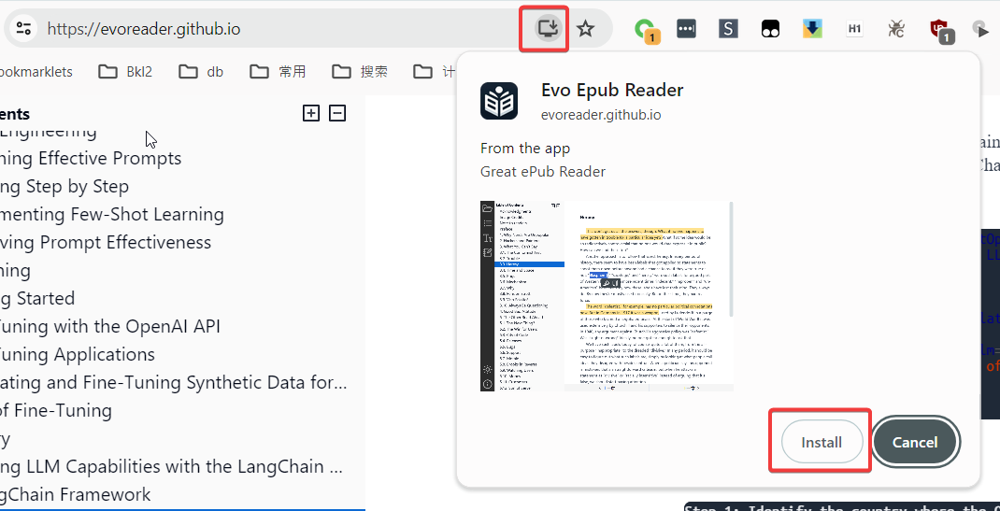
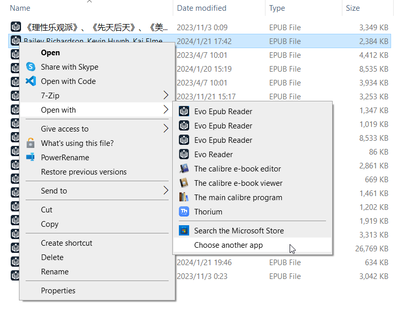
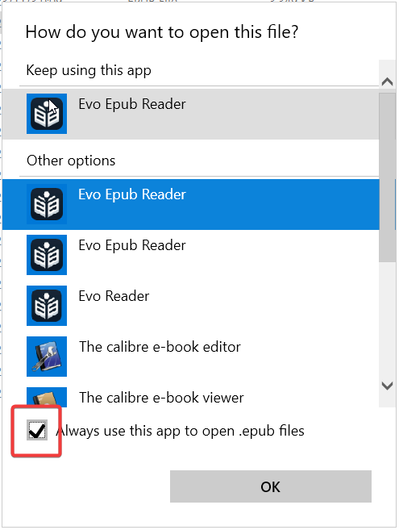
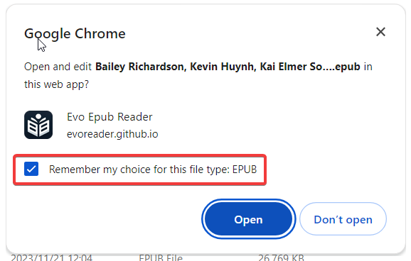
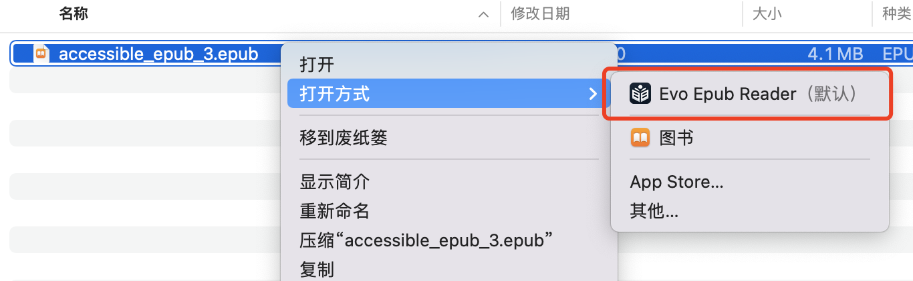

## First, open EvoReader Web: https://evoreader.github.io/
第一步，打开 EvoReader Web ： https://evoreader.github.io/

## Second, click `Install` in the browser address bar:
第二步，在浏览器地址栏点击 **安装** ：

## Third, in the File Explorer, use EvoReader to open .epub files, and set it as the default program:
第三步，在文件管理器中，使用 EvoReader 打开 .epub 文件，并设为默认程序:

## Congratulations! Now, you can use EvoReader to directly open your local epub files.
恭喜你！现在，你可以使用 EvoReader 直接打开你的本地 epub 文件了。

## You can also install EvoReader on Mac or Linux
See: [Choose an app to open a file on Mac - Apple Support](https://support.apple.com/guide/mac-help/choose-an-app-to-open-a-file-on-mac-mh35597/mac)

你同样可以在 Mac 上使用 EvoReader:

